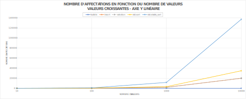
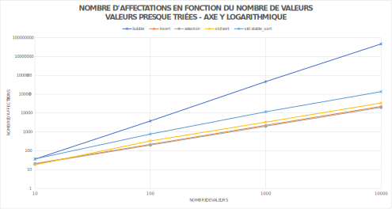
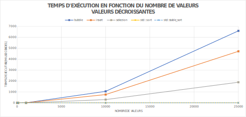

# L1 - Complexité

## Tables des matières
* [Introduction](#Introduction)
* [Affectations](#Affectations)
* [Comparaisons](#Comparaisons)
* [Temps d'exécution](#temps-dexécution)
* [Commentaires](#Commentaires)

## Introduction

Ce labo a été réalisé par Jonathan Friedli, Valentin Kaelin et Lazar Pavicevic. Il a
pour but de comparer le temps d'exécution ainsi que le nombre d'opérations effectuées
par différents algorithmes de tri sur des vecteurs de données agencés de multiples
façons :
* Croissant
* Décroissant
* Presque trié (triés à 70%)
* Aléatoire

Voici la liste des algorithmes que nous allons comparer :

| Algorithme        | Complexité moyenne | Stable |
| -------------     |-------------------:|-------:|
| Tri à bulles      | O(n2)   | Oui    |
| Tri par insertion | O(n2)   | Oui    |
| Tri par sélection | O(n2)   | Non    |
| std::sort         | O(n log(n))        | Non    |
| std::stable_sort  | O(n log(n))        | Oui    |

Nous préciserons lorsque diverses droites se chevauchent sur certains graphiques.
Il est donc préférable de comparer les données en consultant les fichiers csv
fournis.

Les mesures ont été réalisées sur un seul ordinateur pour qu'elles soient cohérentes
(surtout pour les mesures de temps).

Les vecteurs de données ne contiennent que 10'000 éléments pour les opérations et
25'0000 éléments pour les mesures de temps. Ces nombres ont été choisis afin que le
temps de mesure ne soit pas trop long à cause des algorithmes les moins performants.

## Affectations

Dans cette section, nous allons comparer le nombre d'affectations effectués par les
différents algorithmes.

Les axes des graphes sont toujours sur une échelle logarithme à l'exception de 
l'axe Y de l'entrée croissante qui est linéaire.

### Croissant
[ascending.csv](csv/assignment/ascending.csv)

Les droites **insert** et **selection** se chevauchent sur le graphique.

### Décroissant
[descending.csv](csv/assignment/descending.csv)

Les droites **insert** et **selection** se chevauchent sur le graphique.

### Presque trié
[almostSorted.csv](csv/assignment/almostSorted.csv)

Les droites **insert** et **selection** sont très proches sur le graphique.

### Aléatoire
[random.csv](csv/assignment/random.csv)

Les droites **insert** et **selection** se chevauchent sur le graphique.

## Comparaisons

Dans cette section, nous allons comparer le nombre de comparaisons effectuées par les
différents algorithmes.

Les axes des graphes sont toujours sur une échelle logarithme.

### Croissant
[ascending.csv](csv/comparison/ascending.csv)

Les droites **bubble** et **insert** se chevauchent sur le graphique.

### Décroissant
[descending.csv](csv/comparison/descending.csv)

Les droites **bubble** et **selection** se chevauchent sur le graphique.

### Presque trié
[almostSorted.csv](csv/comparison/almostSorted.csv)

Les droites **bubble** et **selection** se chevauchent sur le graphique.

### Aléatoire
[random.csv](csv/comparison/random.csv)

Les droites **bubble** et **selection** se chevauchent sur le graphique.

## Temps d'exécution

Dans cette section, nous allons comparer les temps d'exécutions des différents
algorithmes. Les temps d'exécutions sont mesurés en millisecondes.

Les axes des graphes sont toujours sur une échelle linéaire.

### Croissant
[ascending.csv](csv/time/ascending.csv)

Les droites de tous les algorithmes excepté le **selection** se chevauchent
sur le graphique. On notera que le **bubble** et le **insert** restent à 0ms tandis
que le **std::sort** et **std::stable_sort** atteignent respectivement 2.99ms et 
1.99ms avec une entrée de 25'000 valeurs.

### Décroissant
[descending.csv](csv/time/descending.csv)

Les droites **std::sort** et **std::stable_sort** se chevauchent sur le graphique.

### Presque trié
[almostSorted.csv](csv/time/almostSorted.csv)

Les droites **std::sort** et **std::stable_sort** se chevauchent sur le graphique.

### Aléatoire
[random.csv](csv/time/random.csv)

Les droites **std::sort** et **std::stable_sort** se chevauchent sur le graphique.

## Commentaires
Comme attendu, le **tri à bulles** est l'algorithme le moins rapide en dehors du
cas du vecteur déjà trié. En effet, la version optimisée que nous avons implémentée 
permet de réduire la complexité de ce cas à O(n). Dans les autres cas, son nombre 
d'opérations très élevé impacte sévèrement sa rapidité. Typiquement, sa pire 
performance se trouve dans le cas décroissant où il doit intervertir toutes les 
valeurs sans exception.

Le **tri par insertion** est très efficace en termes de nombre de comparaisons
et d'affectations. C'est quasiment toujours l'algorithme qui fait le moins 
d'opérations. Cependant, par rapport aux algorithmes de la librairie standard, son
implémentation fait qu'il est bien plus lent que ces derniers.

Pour finir avec nos algorithmes maisons, le **tri par sélection** n'est pas plus
efficace que le tri par insertion malgré le fait qu'il ne soit pas stable. Ce qui
en fait un candidat peu recommandable. De plus, ses performances sont toujours
quasiment équivalentes peu importe les données. Ce qui rend son utilisation
questionnable sur des vecteurs presque triés par exemple.

Sans surprise, les fonctions de la librairie standard, implémentées avec des
algorithmes beaucoup plus efficaces (comme l'*intro sort* ou le *merge sort*),
sont beaucoup plus rapides. On observe tout de même que le nombre d'opérations
effectuées par ces deux algorithmes de tri sont quand même plus élevés que pour le 
**tri par insertion** par exemple. Cela est dû aux techniques employées pour 
optimiser la vitesse. Dans le cas de **std::sort**, l'algorithme utilisé est
l'*intro sort*. Il s'agit d'un algorithme hybride qui commence par un *quick sort* 
et passe ensuite par un *heap sort* après un certain moment. Le *quick sort* utilise
le principe du *divide and conquer* en multipliant les opérations simultanées grâce
à la récursivité. C'est grâce à ce genre de techniques que ces algorithmes arrivent
à garder une complexité moyenne de O(n log(n)). L'implémentation de 
**std::stable_sort** fait en sorte de garder les éléments identiques dans l'ordre
initial en utilisant l'algorithme du *merge sort*, ce qui le rend légèrement moins
efficace que **std::sort**. Cette différence se ressent surtout lorsque la taille des
données est bien supérieure aux données traitées dans ce laboratoire (par exemple un
vecteur de 500'000 éléments). Mais on remarque quand même qu'il fait plus 
d'opérations, notamment d'affectations, malgré nos données d'entrées limitées à un
maximum de 10'000 éléments.

### Conclusion
Les différents algorithmes *faits maisons* ont leurs qualités et leurs défauts. 
Certains privilégient l'optimisation des opérations, tandis que d'autres offrent des
performances acceptables dans des cas avec des jeux de données très spécifiques.
Ils ne font cependant pas le poids par rapport aux algorithmes de la libraire
standard en termes de rapidité et de complexité. Car, comme nous l'avons vu, leurs
implémentations restent très basiques et ne profitent pas de techniques comme la 
récursivité (*divide and conquer*).
