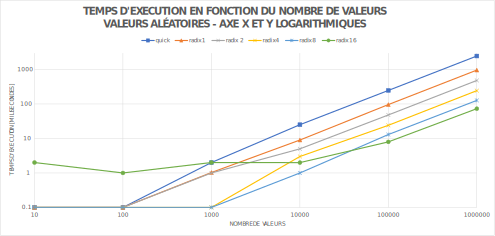

# Rapport Labo 3 - Tris

## Auteurs: 
Jonathan Friedli, Valentin Kaelin et Lazar Pavicevic

## Tables des matières

* [Introduction](#Introduction)
* [Mesures](#Mesures)
* [Analyse](#Analyse)
* [Conclusion](#Conclusion)

## Introduction

Le but de ce laboratoire est de mettre en oeuvre et de comparer les algorithmes de
tri suivants :

* le tri rapide
* le tri par base

Rappel:

| Algorithme   | Complexité moyenne | En place  | Stable |
| -------------|-------------------:|----------:|-------:|
|  Tri rapide  |    O(n log(n))     | Oui       |  Non   |
| Tri par base |       O(n)         | Non       |  Oui   |

Nous effectuons une comparaison entre ces deux algorithmes à l'aide de leur temps d'
exécution. Pour se faire, nous allons prendre des vecteurs de valeurs entières
aléatoires non-signées. Leur taille varie entre 10 et 1'000'000 valeurs. Les mesures
ont étés réalisées avec un processeur Intel i7 9700K et 16GB de ram.

## Mesures

Nos mesures: [measures.csv](csv/measures.csv)

|valeurs |10   |100  |1000 |10000|100000 |1000000 |
|--------|----:|----:|----:|----:|------:|-------:|
|quick   |0    |0    |1.999|25.03|246.969|2458.907|
|radix 1 |0    |0    |1.031|8.998|96.001 |959.999 |
|radix 2 |0    |0    |1    |5    |47.97  |481.033 |
|radix 4 |0    |0    |0    |3    |24     |243.48  |
|radix 8 |0    |0    |0    |0.999|13     |127.032 |
|radix 16|2.001|0.999|1.999|1.998|7.973  |73      |

*Temps mesurés en millisecondes*

## Analyse

*Afin de pouvoir réaliser un graphique avec les deux axes logarithmiques, nous avons
remplacé toutes les valeurs à 0 par
"0,1". En effet, on ne peut pas réaliser un axe logarithmique s'il y a des valeurs à
0.*

La première observation qu'on peut faire est que le tri rapide devient de plus en
plus lent par rapport au tri par base lorsque le jeu de données devient plus
conséquent. Ce qui est prévisible sachant qu'on compare un algorithme ayant une
complexité linéarithmique (le tri rapide) avec le tri par base qui est de complexité
linéaire. L'écart reste néanmoins minime jusqu'à 1'000 valeurs, moins de 2ms d'après
nos mesures.

On remarque que le tri par base avec des groupements de 16 bits a des performances en
dessous du reste pour de petits jeux de valeurs et devient le plus performant par la
suite. Cette observation peut s'expliquer en se rappelant le fonctionnement du tri
par base. Il alloue systématiquement de la mémoire sous la forme d'un tableau de
comptage dont la taille des valeurs varie en fonction du nombre de bits voulus par
groupement. Plus le groupement de bits est grand, plus l'allocation prend du temps.
Dans nos mesures, cet impact est visible pour les deux premiers jeux de valeurs (10
et 100). Cet inconvénient est cependant largement compensé pour des gros jeux de
valeurs où le temps perdu pour l'allocation est rattrapé par la rapidité du triage.

En comparant les tris par base entre eux, on observe que la version avec des
groupements de 8 bits est la plus polyvalente sur nos mesures.

## Conclusion

Comme vu dans la théorie, le tri par base est bien l'un des algorithmes les plus
performants pour un tri de valeurs. Malheureusement, certaines contraintes limitent
fortement une utilisation systématique. Les données doivent être forcément des
valeurs numériques et les gains de temps ne justifient pas dans tous les cas la
consommation élevée de mémoire qui en découle.

Si la mémoire n'est pas un facteur limitant et que les données à trier restent 
des types primitifs, alors le tri par base est définitivement le meilleur choix 
de par sa vitesse d'exécution et la stabilité qu'il procure au triage. Sinon, il 
faudrait privilégier le tri rapide qui est certes plus lent, mais fonctionne dans 
plus de scénarios.
